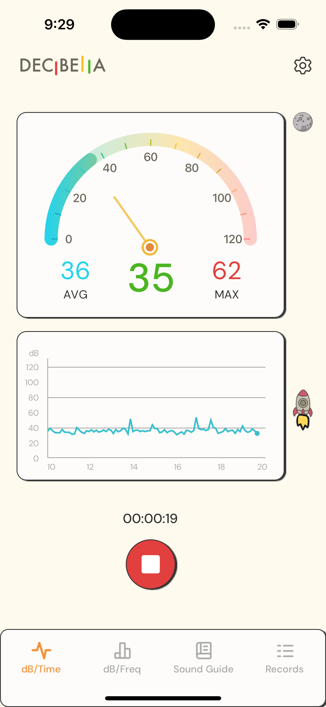
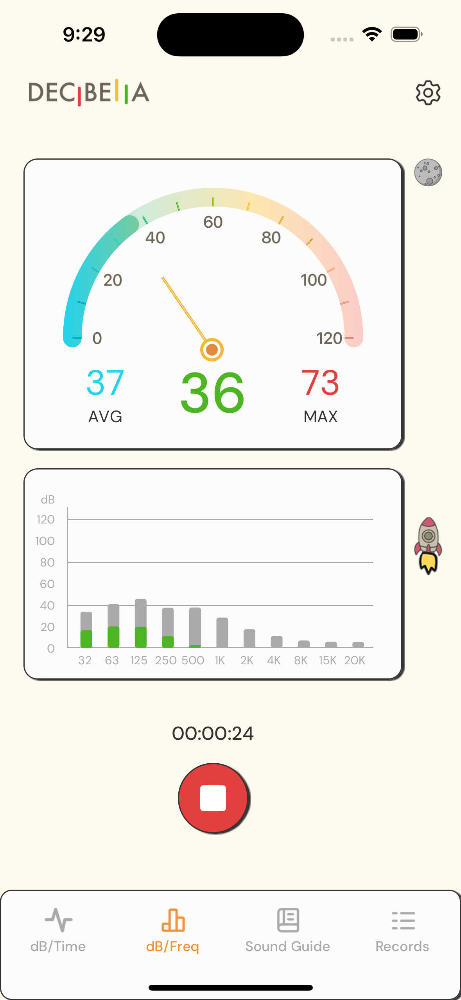
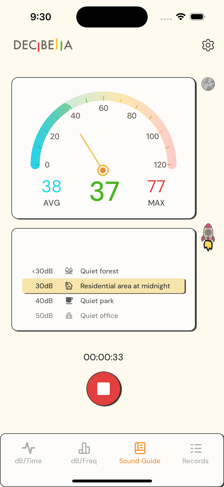
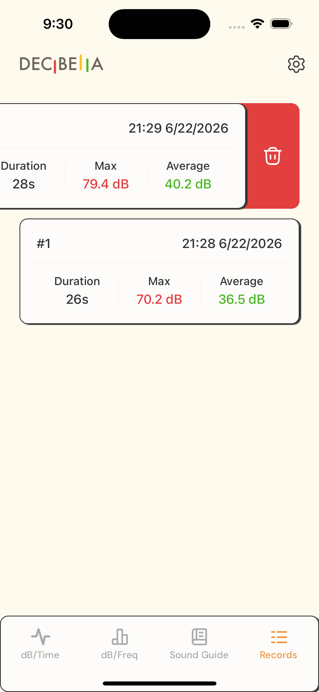
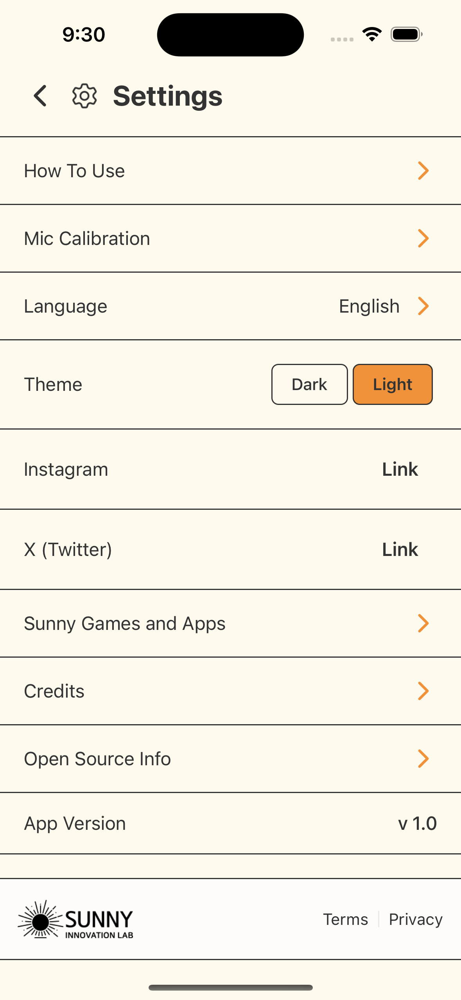
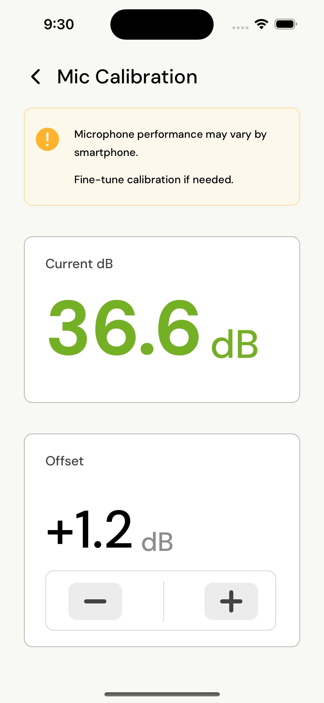

# Decibella Sound Level Meter 한국어 문서

[English README](README.md)

Decibella는 실시간 마이크 기반 소음 모니터링을 위한 Expo / React Native 소음 측정 앱입니다. 실시간 dB 값, 시간 그래프, 주파수 그래프, 소리 예시 가이드, 간단한 로켓 피드백 게임, 보정 기능, 녹음 기록을 제공합니다.

이 앱은 실사용용 모바일 소리 가이드에 가깝고, 공인 실험실용 소음계는 아닙니다. 측정값은 기기 마이크, 운영체제 오디오 경로, 주변 환경, 사용자가 설정한 보정 offset의 영향을 받습니다.

## 주요 기능

- **실시간 소음계**: 현재 dB, 평균 dB, 최대 dB를 애니메이션 게이지와 함께 표시합니다.
- **dB 시간 그래프**: Skia를 사용해 0-120 dB 범위의 실시간 타임라인을 그립니다.
- **주파수 그래프**: FFT 분석 데이터를 바탕으로 32 Hz부터 20 kHz까지의 주파수 밴드를 보여줍니다.
- **Sound Guide**: 측정된 dB 범위를 일상적인 소리 예시와 다국어 라벨로 연결합니다.
- **로켓 피드백 게임**: 현재 dB 값에 따라 로켓이 움직여 소리 크기를 직관적으로 보여줍니다.
- **녹음 제어와 기록**: 측정 시간을 표시하고, 녹음 종료 후 duration, min, max, avg dB를 저장합니다.
- **보정**: -20.0 dB부터 +20.0 dB까지 0.1 dB 단위로 offset을 저장하고 적용할 수 있습니다.
- **다국어 지원**: 영어, 한국어, 일본어, 중국어 간체, 중국어 번체, 프랑스어, 스페인어를 지원합니다.
- **테마 지원**: 라이트/다크 테마를 제공합니다.
- **리워드 광고 접근 흐름**: 긴 측정, Sound Guide, 녹음 기록 접근을 임시 리워드 광고 권한으로 제어합니다.
- **포그라운드 전용 녹음 정책**: 앱이 active 상태를 벗어나면 녹음을 멈추고, 녹음 중에는 화면이 꺼지지 않게 합니다.
- **관측성**: Sentry 추적/오류 보고와 선택적 Amplitude 이벤트 추적을 포함합니다.

## 스크린샷

<table>
  <tr>
    <td align="center"> dB/Time</td>
    <td align="center"> dB/Freq</td>
    <td align="center"> Sound Guide</td>
  </tr>
  <tr>
    <td align="center"> Records</td>
    <td align="center"> Settings</td>
    <td align="center"> Mic Calibration</td>
  </tr>
</table>

## 빠른 둘러보기

앱을 빠르게 이해하려면 다음 순서로 확인하면 됩니다.

1. 앱을 열고 마이크 권한을 허용합니다.
2. 메인 그래프 레이아웃에서 녹음을 시작합니다.
3. 게이지, 현재/AVG/MAX 값, dB 시간 그래프, 주파수 바, Sound Guide, 로켓 피드백이 소리에 반응하는지 봅니다.
4. 녹음을 멈춘 뒤 Log 탭에서 저장된 세션 요약을 확인합니다.
5. Settings에서 Calibration, Language, Theme, Credits, Open Source, Sunny's Games and Apps, 외부 링크를 확인합니다.
6. 녹음 중 앱을 나가거나 화면을 잠가 봅니다. 이 앱은 백그라운드 측정을 의도적으로 지원하지 않으므로 녹음이 멈춰야 합니다.

구현에서 살펴볼 만한 지점:

- `react-native-audio-api`가 마이크 엔진과 분석 데이터를 어떻게 공급하는지
- Zustand slice가 마이크 생명주기, 오디오 지표, 스펙트럼, 통계, 그래프 상태를 어떻게 나누는지
- 빠른 시각 업데이트에 Reanimated shared value와 Skia를 사용하는 이유
- 보정이 주파수별 보정이 아니라 단일 broadband offset인 이유
- 백그라운드 녹음 대신 포그라운드 전용 개인정보 보호 모델을 선택한 이유
- 여러 로컬 agent 빌드가 독립적으로 설치될 수 있도록 app config를 환경 변수 기반으로 구성한 방식

## 앱 구조

| 영역                 | 주요 파일                                                                                                                        |
| -------------------- | -------------------------------------------------------------------------------------------------------------------------------- |
| 라우팅과 탭          | `app/(tabs)/_layout.tsx`, `app/(tabs)/db-time.tsx`, `app/(tabs)/db-freq.tsx`, `app/(tabs)/sound-guide.tsx`, `app/(tabs)/log.tsx` |
| 메인 그래프 레이아웃 | `components/GraphTabLayout.tsx`                                                                                                  |
| 실시간 미터          | `components/SoundMeter.tsx`                                                                                                      |
| dB/time 그래프       | `components/SoundGraph.tsx`, `audio/dbTimeGraph/`                                                                                |
| 주파수 그래프        | `components/FrequencyBarGraph.tsx`, `audio/spectrum/`                                                                            |
| Sound Guide          | `components/SoundGuide.tsx`, `assets/icons/sound-guide/`                                                                         |
| 로켓 피드백          | `components/RocketGamePage.tsx`, `assets/rocket/`                                                                                |
| 녹음 제어            | `hooks/useRecordingControls.ts`, `components/RecordButton.tsx`                                                                   |
| 녹음 기록            | `hooks/useRecordingLogger.ts`, `store/logsStore.ts`, `components/RecordingLogCard.tsx`                                           |
| 포그라운드 생명주기  | `hooks/useRecordingAppLifecycle.ts`                                                                                              |
| 보정                 | `app/settings/calibration.tsx`, `store/calibrationStore.ts`                                                                      |
| 다국어               | `context/LanguageContext.tsx`, `i18n/index.ts`, `locales/*.json`                                                                 |
| 테마                 | `context/ThemeContext.tsx`, `components/themes.ts`                                                                               |
| 리워드 광고          | `context/AdAccessContext.tsx`                                                                                                    |
| 분석과 오류 보고     | `analytics/events.ts`, `analytics/sentry.ts`                                                                                     |
| Expo/native 설정     | `app.config.js`, `plugins/`                                                                                                      |

## 기술 스택

- Expo SDK 54와 Expo Router
- React Native 0.81, React 19
- TypeScript
- 앱/오디오 상태 관리를 위한 Zustand
- 마이크/오디오 분석을 위한 `react-native-audio-api`
- UI-thread 애니메이션을 위한 Reanimated와 Worklets
- 그래프 렌더링을 위한 Skia
- 로그, 보정값, 언어, 광고 접근 상태 저장을 위한 AsyncStorage
- 리워드 광고를 위한 `react-native-google-mobile-ads`
- 운영 진단과 제품 분석을 위한 Sentry, Amplitude
- 다국어 처리를 위한 i18next / react-i18next / expo-localization

## 오디오 파이프라인

앱은 마이크 엔진을 44.1 kHz sample rate와 1024 FFT size로 설정합니다. 마이크 데이터는 오디오 엔진을 거쳐 다음 상태 slice로 분리됩니다.

- 마이크 연결과 녹음 생명주기
- 현재, 평균, 최소, 최대 dB 지표
- 주파수 스펙트럼 바와 피크
- 실행 중 통계
- dB/time 그래프 path

시각 컴포넌트는 업데이트 빈도에 따라 Zustand 상태 또는 Reanimated shared value를 읽습니다. 미터 바늘, 스펙트럼 바, Sound Guide, 로켓 애니메이션처럼 빠르게 움직이는 UI는 불필요한 React render를 줄이기 위해 shared value를 사용합니다.

## 녹음과 개인정보 보호 모델

녹음은 의도적으로 포그라운드에서만 동작합니다.

- 측정 또는 보정 시작 전에 마이크 권한을 요청합니다.
- React Native `AppState`가 `active`가 아니면 녹음을 멈춥니다.
- `expo-keep-awake`는 녹음 중에만 화면 꺼짐을 막습니다.
- 측정 세션이 1초 이상 진행된 경우에만 기록을 저장합니다.
- 보정 세션은 일반 측정 세션과 분리되어 있으며 일반 녹음 로그를 만들지 않습니다.

## 설정

Settings에는 다음 항목이 있습니다.

- Calibration
- Language selection
- Light/dark theme selection
- Social links
- Sunny's Games and Apps
- Credits
- Open source information
- App version
- Terms and privacy policy links

언어 시스템은 사용자가 직접 언어를 선택하기 전까지 기기 언어를 따릅니다. iOS 마이크 권한 문구는 커스텀 Expo config plugin을 통해 locale 파일에서 생성됩니다.
